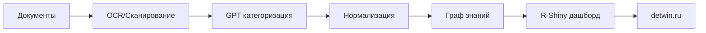

# Техническое задание: MVP Цифрового двойника культурно-исторического развития Белорецка

## 1. Общие сведения

**Наименование:** MVP системы обработки культурно-исторических данных Белорецка  
**Срок выполнения:** 4 недели (2 спринта по 2 недели)  
**Цель:** Создание работающего конвейера от сбора данных до демонстрации результатов на detwin.ru  
**Исполнитель:** Волонтёр-разработчик  
**Куратор:** Сергей Гумеров, "Цифровой Двойник"

## 2. Задачи MVP

### 2.1 Ключевые результаты (KR)

1. **Работающий конвейер обработки данных** - от встречи с хранителем информации до публикации результатов
2. **R-targets пайплайн** - автоматизированная обработка неструктурированных источников  
3. **R-Shiny дашборд** - интерактивная визуализация на detwin.ru
4. **Эталонная архитектура** - воспроизводимый подход для других территорий

### 2.2 Измеримые критерии успеха

- ✅ Обработано минимум 20 исторических документов
- ✅ Создан граф знаний с 50+ узлами и 100+ связями  
- ✅ Развёрнуто рабочее приложение на detwin.ru
- ✅ Документирован весь процесс для воспроизведения

## 3. Архитектура MVP

### 3.1 Конвейер обработки (R-targets)



**Узлы targets:**
1. `scan_documents()` - OCR обработка документов
2. `categorize_entities()` - извлечение сущностей через API
3. `normalize_data()` - создание справочников и связей
4. `build_knowledge_graph()` - построение графа в формате для visNetwork
5. `generate_dashboard()` - создание R-Shiny приложения

### 3.2 Структура проекта

```
beloretsk_cultural_twin/
├── _targets.R              # Конфигурация пайплайна
├── R/                      # R функции
│   ├── data_processing.R
│   ├── entity_extraction.R  
│   ├── graph_builder.R
│   └── shiny_app.R
├── data/
│   ├── raw/               # Исходные документы
│   ├── processed/         # Обработанные данные
│   └── knowledge_graph/   # Граф знаний
├── app/                   # Shiny приложение
│   ├── server.R
│   ├── ui.R
│   └── www/
├── docs/                  # Документация
└── deploy/                # Скрипты развёртывания
```

## 4. Детальный план по спринтам

### Спринт 1 (Недели 1-2): Инфраструктура и сбор данных

#### Неделя 1: Настройка окружения и первые данные
**Sprint Goal:** Настроить инфраструктуру и получить первый датасет

**Задачи:**
1. **Встреча с Еленой Александровной Нероновой** (Краеведческий музей)
   - Договориться о получении материалов 
   - Отсканировать первые 10-15 документов (вырезки из газет)
   - Получить согласие на использование материалов
   - Обсудить возможность партнёрства с "Цифровой Двойник"

2. **Настройка проекта**
   - Создать R-проект с targets
   - Настроить Windsurf для разработки
   - Создать репозиторий на GitHub
   - Настроить базовую структуру папок

3. **OCR обработка**
   - Реализовать функцию scan_documents() с использованием OCR API
   - Обработать первые отсканированные материалы
   - Создать CSV с извлечённым текстом

**Deliverables недели 1:**
- [ ] 10+ отсканированных документов в папке `data/raw/`
- [ ] Рабочий targets-проект с базовой структурой
- [ ] CSV файл с результатами OCR в `data/processed/`
- [ ] Контакт налажен с музеем

#### Неделя 2: NLP обработка и категоризация  
**Sprint Goal:** Извлечь структурированные данные из текстов

**Задачи:**
1. **Настройка NLP пайплайна**
   - Создать промпты для GPT/Claude для извлечения сущностей
   - Реализовать categorize_entities() функцию
   - Настроить извлечение: субъектов, объектов, дат, отношений

2. **Создание справочников**
   - Функция normalize_data() для создания справочников
   - Справочник персоналий (имена, роли, даты жизни) 
   - Справочник объектов (заводы, рудники, населённые пункты)
   - Справочник типов отношений

3. **Первые результаты**
   - Обработать все отсканированные документы
   - Создать фактографическую таблицу (как в хакатоне)
   - Валидировать результаты экспертно

**Deliverables недели 2:**
- [ ] Функции `categorize_entities()` и `normalize_data()` 
- [ ] Справочники в CSV формате
- [ ] Фактографическая таблица с 30+ фактами
- [ ] Первый working targets пайплайн

### Спринт 2 (Недели 3-4): Визуализация и деплой

#### Неделя 3: Граф знаний и дашборд
**Sprint Goal:** Создать интерактивную визуализацию данных

**Задачи:**
1. **Построение графа знаний**
   - Функция build_knowledge_graph() 
   - Создание nodes и edges для visNetwork
   - Реализация фильтрации по времени и типам объектов
   - Добавление метаданных к узлам (фото, описания)

2. **R-Shiny приложение**  
   - Базовый UI с visNetwork графом
   - Поиск по субъектам/объектам
   - Фильтры по периодам и типам отношений
   - Детальные карточки объектов при клике

3. **Контент и дизайн**
   - Добавить фотографии исторических объектов
   - Создать описания ключевых персоналий
   - Настроить привлекательный дизайн дашборда

**Deliverables недели 3:**
- [ ] Функция `build_knowledge_graph()` в targets
- [ ] Работающее R-Shiny приложение локально
- [ ] Граф с 50+ узлами и визуализацией связей
- [ ] Поиск и фильтрация в интерфейсе

#### Неделя 4: Деплой и документация
**Sprint Goal:** Опубликовать приложение на detwin.ru и задокументировать процесс

**Задачи:**
1. **Развёртывание на detwin.ru**
   - Настроить хостинг Shiny приложения
   - Подключить домен/поддомен detwin.ru  
   - Настроить автоматическое обновление из GitHub
   - Протестировать работу в продакшене

2. **Документация и воспроизводимость**
   - README с инструкцией по развёртыванию
   - Документация архитектуры конвейера  
   - Шаблон для новых территорий
   - Видеодемонстрация результата

3. **Подготовка к масштабированию** 
   - Выявить узкие места производительности
   - Спланировать интеграцию с API нейросетей
   - Подготовить план развития на следующий спринт

**Deliverables недели 4:**
- [ ] Рабочее приложение на https://beloretsk.detwin.ru
- [ ] Полная документация проекта
- [ ] Шаблон для воспроизведения на других территориях  
- [ ] Презентация результатов с демо

## 5. Технические требования

### 5.1 Обязательные технологии

**R-экосистема:**
- `targets` - управление пайплайном обработки данных
- `shiny` - веб-интерфейс  
- `visNetwork` - визуализация графов
- `DT` - интерактивные таблицы
- `plotly` - дополнительная аналитика

**Интеграции:**
- OCR API (Tesseract или облачные сервисы)
- LLM API (OpenAI GPT или Anthropic Claude)
- GitHub для версионирования
- Shiny Server или shinyapps.io для хостинга

**Форматы данных:**
- CSV для табличных данных
- JSON для графа знаний  
- Markdown для документации

### 5.2 Инфраструктурные требования

**Локальная разработка:**
- R 4.3+ и RStudio
- Windsurf AI-среда для кодирования
- Git для версионирования

**Продакшен:**
- VPS или облачный сервер для Shiny  
- Домен detwin.ru с поддоменом
- SSL сертификат
- Базовый мониторинг приложения

## 6. Источники данных для MVP

### 6.1 Первичные источники (обязательные)

1. **Краеведческий музей (Елена Неронова)**
   - Вырезки из газеты "Белорецкий рабочий"
   - Архивные материалы о заводах
   - Фотографии исторических объектов

2. **Публичные источники**
   - Википедия статьи о Белорецких заводах
   - Сайт Белорецкого металлургического музея
   - Краеведческие публикации в интернете

### 6.2 Дополнительные источники (желательные)

3. **Белорецкая библиотека** 
   - Оцифрованные книги о Белорецке
   - Местные краеведческие издания

4. **Архивы предприятий**
   - История Белорецкого металлургического комбината
   - Документы по другим заводам района

**Минимальный объём для MVP:** 20-30 документов, 50+ исторических фактов

## 7. Модель данных

### 7.1 Основные таблицы

**facts.csv** - фактографическая таблица (как в хакатоне)
```csv
id,subject,object,relation_type,date_start,date_end,description,source
1,Твердышев И.Б.,Белорецкий завод,основатель,1762,1762,Основание завода,Краеведческий музей
```

**entities.csv** - справочник сущностей  
```csv
id,name,type,description,birth_date,death_date,coordinates
1,Твердышев Иван Борисович,person,Промышленник XVIII века,1710,1787,
2,Белорецкий завод,facility,Железоделательный завод,,,55.9333;58.3987
```

**relations.csv** - типы отношений
```csv
id,name,description,color
1,основатель,Основал предприятие,#ff6b6b
2,владелец,Владел предприятием,#4ecdc4  
3,управляющий,Управлял предприятием,#45b7d1
```

### 7.2 Граф знаний (JSON)

```json
{
  "nodes": [
    {"id": 1, "label": "Твердышев И.Б.", "group": "person", "title": "Промышленник XVIII века"},
    {"id": 2, "label": "Белорецкий завод", "group": "facility", "title": "Железоделательный завод"}
  ],
  "edges": [
    {"from": 1, "to": 2, "label": "основатель", "color": "#ff6b6b", "arrows": "to"}
  ]
}
```

## 8. Интерфейс приложения

### 8.1 Главная страница

**Компоненты:**
- Интерактивный граф знаний (visNetwork)
- Поиск по персоналиям и объектам
- Фильтры: период времени, тип объекта, тип отношений
- Счётчики: количество фактов, персоналий, объектов

**Функционал:**
- Клик по узлу → карточка с подробной информацией
- Наведение → краткая информация  
- Группировка узлов по типам (персоналии, объекты, территории)
- Временная шкала для фильтрации

### 8.2 Дополнительные страницы

**Страница "Источники":**
- Список обработанных документов
- Превью отсканированных материалов
- Ссылки на оригинальные источники

**Страница "О проекте":**
- Описание целей и методологии
- Информация о партнёрах
- Контакты для сотрудничества

## 9. План встреч с хранителями данных

### 9.1 Елена Александровна Неронова (Краеведческий музей)

**Первая встреча (Неделя 1):**
- Представить проект "Цифровой двойник Белорецка"
- Обсудить возможности сотрудничества  
- Получить доступ к архивным материалам
- Отсканировать первые документы

**Повторные встречи:**
- Еженедельно для получения новых материалов
- Валидация результатов обработки
- Обратная связь по функционалу приложения

### 9.2 Другие потенциальные источники

**Металлургический музей:**
- Техническая документация заводов
- Фотографии производственных процессов

**Местные краеведы:**
- Устные истории и воспоминания
- Частные архивы и коллекции

## 10. Критерии приёмки MVP

### 10.1 Технические критерии

- [ ] R-targets пайплайн выполняется без ошибок
- [ ] Приложение доступно на detwin.ru  
- [ ] Граф содержит минимум 50 узлов
- [ ] Поиск работает по всем типам сущностей
- [ ] Время загрузки страницы < 5 секунд

### 10.2 Пользовательские критерии

- [ ] Интуитивно понятный интерфейс
- [ ] Все исторические факты имеют источники
- [ ] Корректность данных проверена экспертом
- [ ] Мобильная адаптация интерфейса

### 10.3 Документационные критерии  

- [ ] README с инструкцией по развёртыванию
- [ ] Схема архитектуры конвейера
- [ ] Описание модели данных
- [ ] Инструкция для добавления новых источников

## 11. Следующие шаги после MVP

### 11.1 Краткосрочные (месяц 2)
- Интеграция дополнительных источников данных
- API для подключения нейросетей к отдельным узлам  
- Расширение географического охвата
- Мобильное приложение

### 11.2 Долгосрочные (3-6 месяцев)
- Интеграция с цифровым двойником социально-экономического развития
- Машинное обучение для автоматической категоризации
- Краудсорсинг для верификации данных
- Масштабирование на другие территории Башкортостана

---

**Контакты:**
- Куратор: Сергей Гумеров, "Цифровой Двойник"  
- Email: info@dtwin.ru
- Краеведческий музей: Елена Александровна Неронова

*Документ создан в рамках проекта создания цифрового двойника культурно-исторического развития Белорецка*
